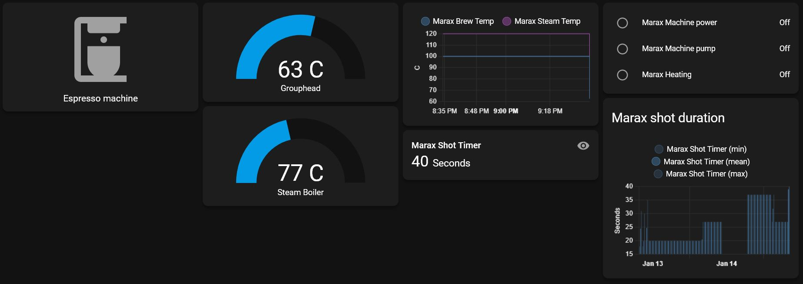

# MaraX Timer

> This project was designed to be used with a Lelit MaraX espresso machine.

***This repository is a rewrite of [espresso_timer](https://github.com/alexrus/espresso_timer) that has better doccumentation and is easier to use.***

<div align="center">
    
    
</div>

## Hardware

- NodeMCU (ESP8266) like the [Wemos D1 Mini](https://www.aliexpress.com/item/32631775619.html?spm=a2g0o.productlist.0.0.7ae11669WSH2Ua&algo_pvid=7ec378fa-316d-4fc3-8d04-2480b812b00a&algo_exp_id=7ec378fa-316d-4fc3-8d04-2480b812b00a-2&pdp_ext_f=%7B%22sku_id%22%3A%2259462098504%22%7D&pdp_pi=-1%3B13.83%3B-1%3B-1%40salePrice%3BDKK%3Bsearch-mainSearch)
- [0.96" oled display](https://www.aliexpress.com/item/32643950109.html?spm=a2g0o.productlist.0.0.48a21e01poMPas&algo_pvid=b74220bc-68ba-4bbf-9dce-39ac3d62fdc1&algo_exp_id=b74220bc-68ba-4bbf-9dce-39ac3d62fdc1-3&pdp_ext_f=%7B%22sku_id%22%3A%2266429289908%22%7D&pdp_pi=-1%3B14.48%3B-1%3B-1%40salePrice%3BDKK%3Bsearch-mainSearch)
- [Reed sensor](https://www.aliexpress.com/item/4000528679917.html?spm=a2g0o.productlist.0.0.69f62377nmi0en&algo_pvid=30c3b05e-26ef-4a0b-908f-b5bcd0968800&algo_exp_id=30c3b05e-26ef-4a0b-908f-b5bcd0968800-2&pdp_ext_f=%7B%22sku_id%22%3A%2210000002690669866%22%7D&pdp_pi=-1%3B8.7%3B-1%3B-1%40salePrice%3BDKK%3Bsearch-mainSearch)
- 3d printed case ([3D Printer Monitor for Octoprint ESP8266 NodeMCU](https://www.thingiverse.com/thing:2937731)/[3D Printer Monitor for OctoPrint Wemos D1 ESP8266](https://www.thingiverse.com/thing:2884823))

## Software

In order to make NodeMCU working with Arduino IDE follow these instructions: [https://www.instructables.com/id/Quick-Start-to-Nodemcu-ESP8266-on-Arduino-IDE/](https://www.instructables.com/id/Quick-Start-to-Nodemcu-ESP8266-on-Arduino-IDE/). If you having troubles insalling the Github dependencies follow this guide: [Installing Arduino Library from GitHub](https://www.baldengineer.com/installing-arduino-library-from-github.html). 


This project uses the following dependencies:

* [https://github.com/adafruit/Adafruit_SSD1306](https://github.com/adafruit/Adafruit_SSD1306)
* [https://github.com/adafruit/Adafruit_BusIO](https://github.com/adafruit/Adafruit_BusIO)
* [https://github.com/adafruit/Adafruit-GFX-Library](https://github.com/adafruit/Adafruit-GFX-Library)
* [https://github.com/knolleary/pubsubclient/](https://github.com/knolleary/pubsubclient/)
* [https://github.com/JChristensen/Timer](https://github.com/JChristensen/Timer)


## Hardware connections

### OLED wiring
You connect the oled display like this:


### Reed sensor
- [Glue the reed switch onto the machine's vibration pump](resources/pump.jpg)
- The reed switch goes to ground and D7

### MaraX wiring

[Open the underside of the machine](http://www.youtube.com/watch?v=9NL6yeq7sMM) and you will see a [6 pin connector](https://preview.redd.it/mwf5u76b24751.jpg?width=3024&format=pjpg&auto=webp&s=e3af4370ee876cb590f7f007cb0ec9ed29688225).

- Connect pin 3 of the machine (RX) to pin D6 (TX) of nodeMCU
- Connect pin 4 of the machine (TX) to pin D5 (RX) of nodeMCU 

> *In case this does not work, change the pins connection (pin 3 to D5 & pin 4 to D6)*

## Operation

The timer display will power on and off with the MaraX.

### Shot Counter

When the pump will start, the timer on the screen will also start counting.

When the pump is stopped, the time will remain printed on the screen (if more that 15 seconds have passed) until the next time the pump is activated.

The time is not recorded unless 15 seconds have passed because MaraX machine starts the pump by itself from time to time to fill the boiler with water.

### MQTT

If you connect the ESP to the wifi and provide a MQTT bridge the following messages will be broadcasted:

- `/marax/power` with `on` or `off`
- `/marax/pump` with `on` or `off`
- `/marax/hx` with the current temperature of the heat exchanger
- `/marax/steam` with the current temperature of the steam boiler
- `/marax/shot` with the duration of the last shot (if the shot took longer than 15 seconds)
- `/marax/machineheating` with `on` or `off`
- `/marax/machineheatingboost` with `on` or `off`

### Homeassistant integration

If you want to get this to work with your homeassistant server do the following.

Install Mosquitto broker on your homeassistant server and setup Home Assistant to connect to the broker as per the [oficial instructions](https://www.home-assistant.io/docs/mqtt/broker/)

Once the broker is up and running and Home Assistant is able to connect to it you will want to add the MQTT sensors into your configuration, for Home Assistant to pick them up.
Use the following code for this.

```yaml
sensor:
  # Espresso timer Mara X
  - platform: mqtt
    name: Marax Brew Temp
    state_topic: "/marax/hx" 
    unit_of_measurement: "C"
  - platform: mqtt
    name: Marax Steam Temp
    state_topic: "/marax/steam" 
    unit_of_measurement: "C"
  - platform: mqtt
    name: Marax Shot Timer
    state_topic: "/marax/shot"
    unit_of_measurement: "Seconds"
    state_class: measurement

binary_sensor:
    #Espresso timer Mara X
  - platform: mqtt
    name: Marax Machine power
    state_topic: "/marax/power"
    payload_on: 'on'
    payload_off: 'off' 
  - platform: mqtt
    name: Marax Machine pump
    state_topic: "/marax/pump"
    payload_on: 'on'
    payload_off: 'off'
  - platform: mqtt
    name: Marax Heating
    state_topic: "/marax/machineheating"
    payload_on: 'on'
    payload_off: 'off'
  - platform: mqtt
    name: Marax Steam Boost
    state_topic: "/marax/machineheatingboost"
    payload_on: 'on'
    payload_off: 'off'
```

When all this is done reboot the Home Assistant server and you will then be able to use the MQTT sensors in cards as in the following picture.

<div align="center">
    
</div>

## Good Reads

- [More information about the project and progress](https://www.home-barista.com/espresso-machines/lelit-marax-t61215-350.html#p723763)
- [Data Visualisation - Lelit MaraX 'Mod'](https://www.reddit.com/r/Coffee/comments/hfsvep/data_visualisation_lelit_marax_mod/)
